<div align="center">



**AI Red Team Framework**

[](https://www.python.org/downloads/)
[](https://opensource.org/licenses/MIT)
[](https://pepy.tech/projects/aix-framework)

*Automated security testing for AI/LLM endpoints — from recon to exploitation.*

<!-- demo GIF goes here -->
<!--  -->

</div>

---

## Install

```bash
pip install aix-framework
```

```bash
# with ML fingerprinting support
pip install aix-framework[ml]
```

Or from source:
```bash
git clone https://github.com/licitrasimone/aix-framework.git
cd aix-framework && pip install -e .
```

---

## Quickstart

```bash
# Step 1 — fingerprint the target and detect guardrails
aix recon https://api.target.com/chat -k sk-xxx

# Step 2 — attack (bypass engine activates automatically if a guardrail was found)
aix inject https://api.target.com/chat -k sk-xxx
aix jailbreak https://api.target.com/chat -k sk-xxx

# Run everything
aix scan https://api.target.com/chat -k sk-xxx

# Export report
aix db --export report.html
```

**Works with any endpoint** — OpenAI, Anthropic, Ollama, Azure, AWS Bedrock, WebSockets, or raw HTTP via Burp Suite request files.

---

## What it does

| Module | What it tests |
|---|---|
| `recon` | API structure, model fingerprinting, guardrail detection (8 providers) |
| `inject` | Prompt injection — direct, indirect, instruction override |
| `jailbreak` | Safety bypass — DAN variants, roleplay, developer mode |
| `extract` | System prompt extraction |
| `leak` | Training data leakage, PII in responses |
| `exfil` | Exfiltration channels — markdown, links, webhooks |
| `agent` | Tool abuse, privilege escalation, unauthorized actions |
| `dos` | Token exhaustion, rate limits, infinite loops |
| `fuzz` | Edge cases, unicode, encoding attacks |
| `memory` | Context manipulation, conversation history poisoning |
| `rag` | RAG-specific attacks — indirect injection, context poisoning, KB extraction |
| `multiturn` | Multi-turn attacks — crescendo, trust building, instruction layering |
| `fingerprint` | Probabilistic LLM identification (embedding + pattern analysis) |
| `chain` | YAML-defined attack workflows with conditional branching |

---

## Key Features

**Adaptive Bypass Engine**
After `aix recon` detects a guardrail, all subsequent attack modules automatically apply targeted evasion techniques based on the detected provider's known weaknesses — no flags needed. Use `--no-bypass` to disable.

**Guardrail Fingerprinting**
Detects which safety layer is deployed in front of the model: OpenAI Moderation, Azure Content Safety, AWS Bedrock Guardrails, Llama Guard, Lakera Guard, Perspective API, NeMo Guardrails, or custom filters. Returns confidence score, sensitivity profile per content category, and known bypass weaknesses.

**MITRE ATLAS + OWASP LLM Top 10**
Every finding is tagged with both MITRE ATLAS technique IDs and OWASP LLM Top 10 categories. Reports are credible in enterprise red team contexts.

**Attack Chains**
Chain modules together in YAML playbooks with conditional branching, variable interpolation, and state passing between steps.

```bash
aix chain https://api.target.com -k sk-xxx -P full_compromise
```

**AI-Powered Testing**
Use a secondary LLM as judge to evaluate attack success, gather target context, and generate domain-aware payloads.

```bash
aix inject https://api.target.com -k sk-xxx --ai openai --ai-key sk-xxx -g 5
```

**Burp Suite + WebSocket support**
```bash
aix inject -r request.txt -p "messages[0].content"
aix inject wss://api.target.com/ws -k sk-xxx
```

---

## Session-Aware Workflow

AIX groups every scan into sessions by target. The bypass engine reads guardrail data stored by a prior recon run — so the workflow is:

```
aix recon  →  detects LlamaGuard (85% confidence)
                └─ stores result in session DB

aix inject →  reads session → auto-applies token-split + base64 evasion
               "[*] Auto-bypass active: LlamaGuard — token-split, base64-segment"
```

Browse sessions and conversations:
```bash
aix db --sessions
aix db --session <id>
aix db --conversations
```

---

## Documentation

Full documentation on the [Wiki](https://github.com/licitrasimone/aix-framework/wiki):
- [Module Reference](https://github.com/licitrasimone/aix-framework/wiki/Modules)
- [Attack Chain Playbooks](https://github.com/licitrasimone/aix-framework/wiki/Attack-Chains)
- [Adding Modules & Payloads](https://github.com/licitrasimone/aix-framework/wiki/Adding-Modules)
- [Payload Schema](https://github.com/licitrasimone/aix-framework/wiki/Payload-Schema)

---

## Disclaimer

For authorized security testing only. Always obtain explicit permission before testing AI systems. The authors are not responsible for misuse.

---

<div align="center">
MIT License — <a href="LICENSE">LICENSE</a><br><br>
Made with ❤️ by r08t
</div>
